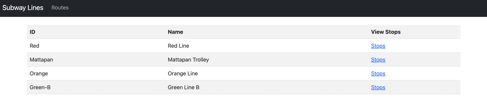
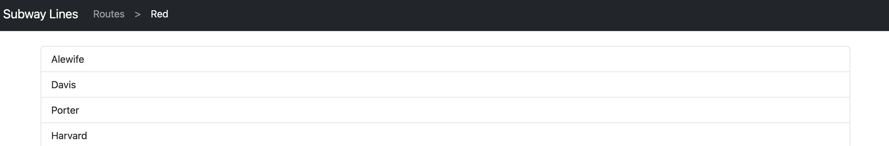

# README

## Pre-requisites
Ruby version 3.0.0<br>
Rails version 7.0.4<br>
NPM version 8.19.2<br>
Yarn version 1.22.19<br>

### Useful links
https://guides.rubyonrails.org/getting_started.html<br>
https://nodejs.org/en/download/<br>
https://yarnpkg.com/lang/en/docs/install/


## Start local server
In your terminal, navigate to the root folder and run `rails s`<br>
In your browser, navigate to `localhost:3000`


## Play around
  View routes.<br>
<br><br>
  View stops for a route.<br>



## Tests
```rails test```
